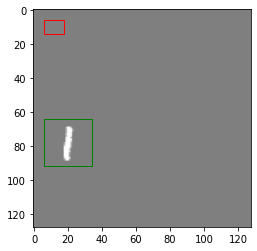
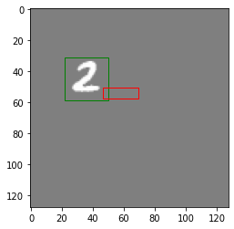
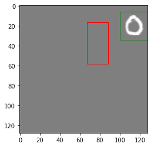
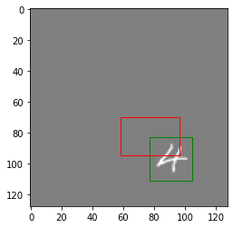
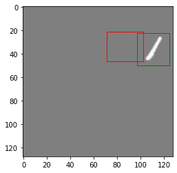
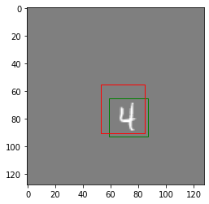
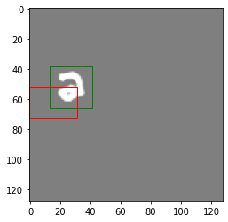
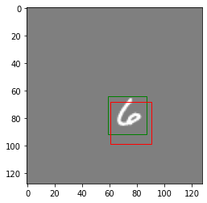
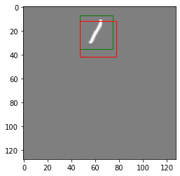
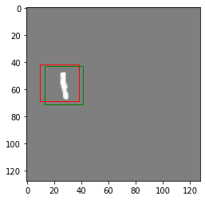

# Object Detection using MNIST Dataset

## Overview
This project implements an object detection model using the MNIST dataset, which places digits onto a larger canvas, draws bounding boxes around them, and trains a convolutional neural network (CNN) to predict the bounding box coordinates. The code includes the process of data augmentation, object detection using CNN, and visualization of both ground truth and predicted bounding boxes.

## Key Features
1. **Data Preparation**: The MNIST dataset is transformed, and digits are placed randomly on a larger canvas of size 128x128. Bounding box coordinates are calculated for each digit.
   
2. **Bounding Box Visualization**: Functions for drawing bounding boxes on images are provided. Both ground truth and predicted bounding boxes are displayed for comparison.

3. **Custom Dataset**: A custom dataset is created by saving the transformed images and their respective bounding boxes to disk. These are loaded later using PyTorch's `Dataset` class for training.

4. **Object Detection Model**: A CNN is designed to predict the bounding box coordinates of the digits placed on the canvas. The architecture includes multiple convolutional, batch normalization, and dropout layers.

5. **Loss Function and Optimizer**: The model is trained using the Smooth L1 Loss function and optimized with the Adam optimizer.

6. **Visualization of Predictions**: The model displays a comparison between the ground truth and predicted bounding boxes during the training process, enabling visual inspection of model performance.
##  Training Loop
The model is trained over 20 epochs using the Adam optimizer. Each epoch computes the loss between predicted and actual bounding box coordinates, followed by backpropagation to update the model weights.
1. **Forward Pass:** The model predicts bounding box coordinates for each input image.
2. **Loss Calculation:** The predicted bounding boxes are compared with the ground truth bounding boxes. The loss function used is the **Smooth L1 Loss**, which is well-suited for bounding box regression tasks as it combines both L1 and L2 loss. It is less sensitive to outliers than the mean squared error (MSE) loss.
3. **Backpropagation:** Gradients are calculated based on the loss, and the model's weights are updated accordingly to minimize the error.
4. **Visualization:** During training, both the predicted and ground truth bounding boxes are visualized on the image, enabling real-time comparison of model accuracy.

##  Visualization of Bounding Boxes
A custom function is used to visualize both the predicted and actual bounding boxes on the image during training, allowing for visual comparison of model performance.

## 6. Bounding Box Visualization

Below are the images showing the predicted bounding boxes (in red) and the actual bounding boxes (in green) drawn during training:

| Image  | Predicted vs Actual Bounding Box |
|--------|----------------------------------|
|  | Predicted and Actual Bounding Box for Image 1 |
|  | Predicted and Actual Bounding Box for Image 2 |
|  | Predicted and Actual Bounding Box for Image 3 |
|  | Predicted and Actual Bounding Box for Image 4 |
|  | Predicted and Actual Bounding Box for Image 5 |
|  | Predicted and Actual Bounding Box for Image 6 |
|  | Predicted and Actual Bounding Box for Image 7 |
|  | Predicted and Actual Bounding Box for Image 8 |
|  | Predicted and Actual Bounding Box for Image 9 |
|  | Predicted and Actual Bounding Box for Image 10 |

Each image illustrates a comparison between the predicted bounding box (red) and the actual bounding box (green).

